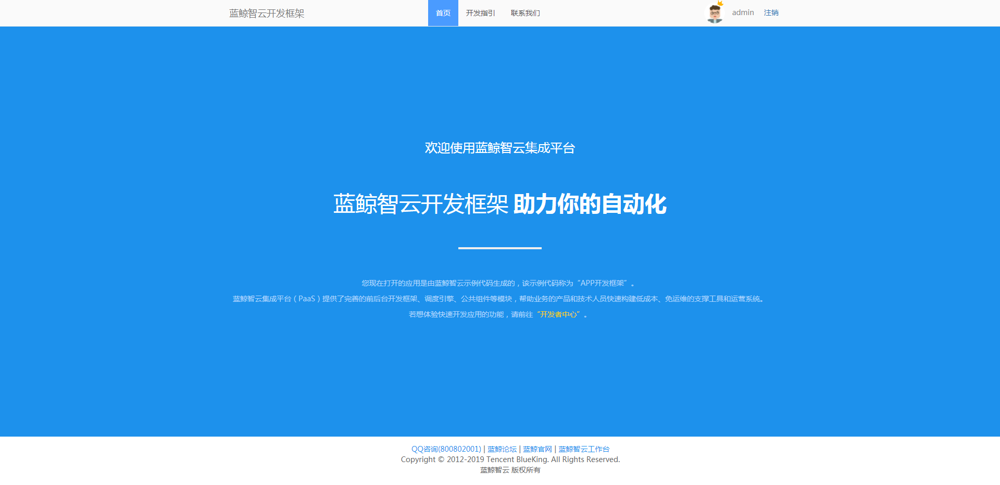

## 蓝鲸 SaaS 开发环境本地搭建和部署到测试环境（基于开发框架1.0）

#### 一、环境准备

本地环境：

- 操作系统：Windows7

需要安装：`Python2.7`、`MySQL5.6`

##### 安装 Python2.7

可以前往官网下载安装，如果网络不支持可以前往腾讯软件中心下载安装。

##### 安装 MySQL5.6

下载地址 [MySQL5.6 下载地址](http://paas-10032816.cos.myqcloud.com/mysql-installer-community-5.6.28.0.msi)，按照提示安装即可。

##### 准备 Git 和 GitLab 仓库

安装好 Git，并且创建好该项目的 GitLab 仓库。

下载[蓝鲸框架源码](http://bkdocument-1252002024.costj.myqcloud.com/framework.tar.gz)，解压到本地。


将该目录的代码上传到 GitLab 。

```bash
git init
git remote add origin http://{{ gitlab 仓库地址 }}
git add .
git commit -m "init repo"
git push origin
```


##### 创建应用

进入 `开发者中心` - `我的应用` - `创建应用`，按提示填写应用（SaaS）信息即可。 


##### 配置 IDE 和虚拟环境，这里我用的是 Pycharm

`File`  - `Open` 选择代码所在目录打开。

配置项目虚拟环境，进入 Setting。


选择创建新的虚拟环境。


返回解释器选择界面，选择刚刚创建虚拟环境目录下的 Python 解释器。


打开项目目录下 `requirements.txt`，注释掉 `uWSGI==2.0.13.1`

在 Pycharm 的 Terminal 输入 `pip install -r requirements.txt` 下载项目相关依赖包。

下载依赖包时需要注意当前终端是否在虚拟环境，如果命令提示符没有如图所示的 `venv` 前缀，可以重启下 Pycharm。


下载完成后将 `uWSGI==2.0.13.1` 取消注释，uWSGI 在服务器上部署时需要用到。

至此，准备工作已经做好。

#### 二、初始化开发框架

##### 修改配置文件

修改 `conf/default.py` 中的 `APP_ID` `APP_TOKEN` `BK_PAAS_HOST`。

它们分别是你创建应用的应用 ID，应用 TOKEN，以及你 PaaS 平台的域名。

##### 创建数据库和配置数据库

进入 MySQL 创建一个给该项目的数据库

```bash
CREATE DATABASE `{NAME}` default charset utf8 COLLATE utf8_general_ci;
```

在 `config/settings_development.py` 文件中配置本地数据库信息。

打开终端输入：

```bash
python manage.py migrate
```

如果该命令成功，说明本地数据库配置已经没有问题。

##### 启动本地项目

首先修改本地 hosts

```
127.0.0.1 appdev.{PAAS_URL}
```

启动项目

```
python manage.py runserver
```

本地访问

用浏览器访问 `http://appdev.{domain_name}:8000` , 就可以看到开发框架 。



#### 三、将项目部署带测试环境

##### 配置测试环境数据库

进入蓝鲸中控机：

```bash
source /data/install/utils.fc
mysql -u$MYSQL_USER -p$MYSQL_PASS -h$MYSQL_IP0
# 创建数据库
CREATE DATABASE `{NAME}` default charset utf8 COLLATE utf8_general_ci;
# 创建用户并赋予权限
CREATE USER 'xxx'@'192.168.%' IDENTIFIED BY "xxx";
GRANT ALL ON { database name }.* TO 'xxx'@'192.168.%';
# 刷新权限
FLUSH PRIVILEGES;
```

修改 `conf/settings_testing.py` 内数据库的配置。

修改后将代码 push 至 GitLab。

进入 PaaS 平台开发者中心，将应用部署至测试应用。


短暂的等待后项目部署成功。


测试环境的部署已经完成，若是想要部署到正式环境只需在数据库再配置即可。

