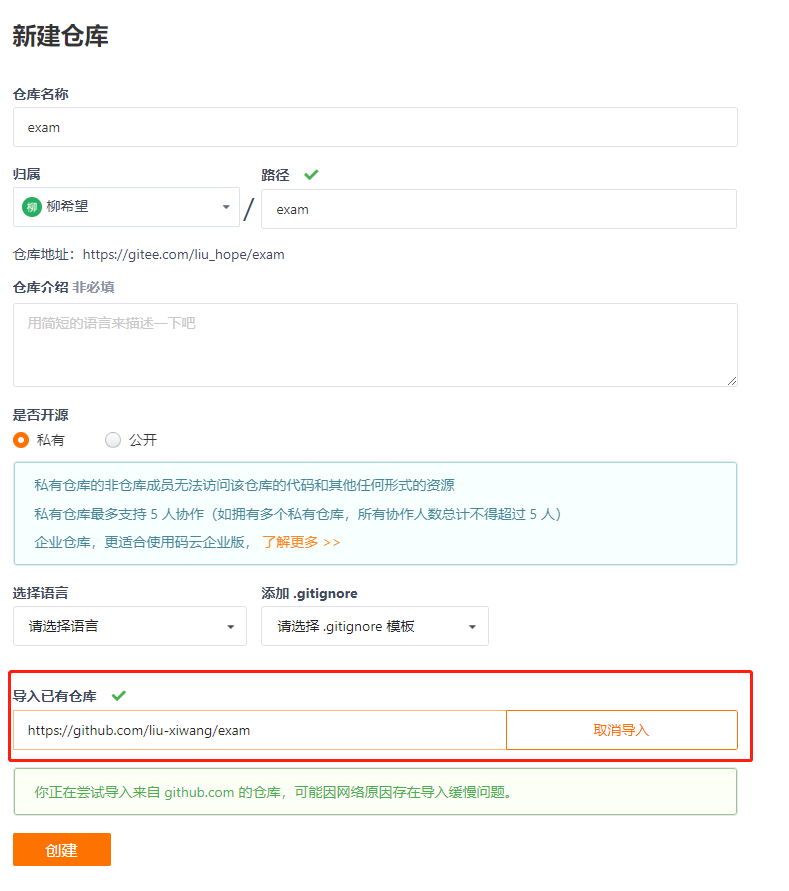
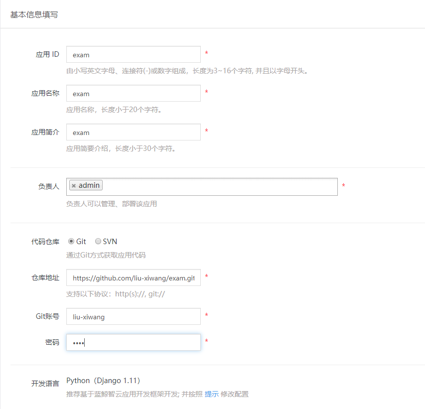
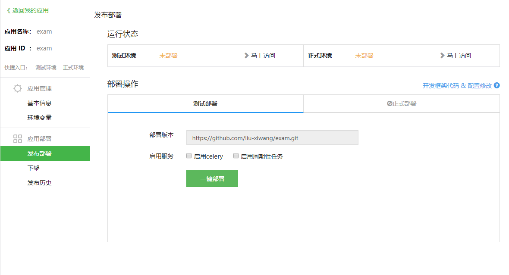
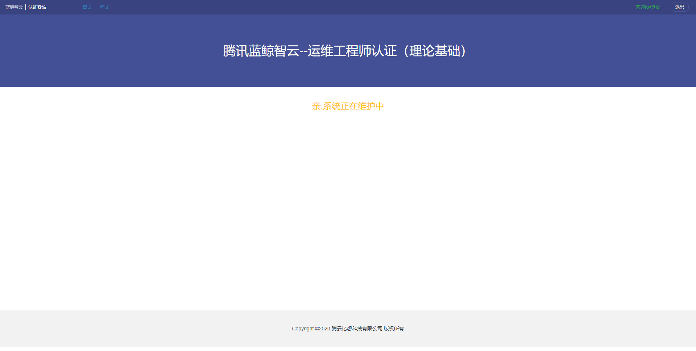

## 部署考试系统

> 数据库文件：question.sql

#### 1. 准备GIT

源码 GitHub 地址： https://github.com/liu-xiwang/exam 

**如果使用 GitHub**

进入  https://github.com/liu-xiwang/exam 源码仓库，将该仓库 fork 至自己账户下即可。

**如果使用 Gitee**

新建仓库从 Github 导入即可。




#### 2. 准备数据库

进入蓝鲸中控机

```shell
source /data/install/utils.fc && mysql -u$MYSQL_USER -p$MYSQL_PASS -h$MYSQL_HOST
```

进入数据库后创建测试环境的数据库

```sql
create database {database name} default charset utf8 COLLATE utf8_general_ci;
```

创建用户并赋予权限  

```sql
grant all on {database name}.* to '{user}'@'{host}' identified by '{paasword}' 
```

得到 MySQL 的 IP

```
ping mysql.service.consul
```

#### 3. 创建应用

进入 paas 平台开发者中心，创建应用。



#### 4. 修改代码配置

因为只需要修改几个配置文件，所以也不需要 clone 仓库了，直接在网页修改即可。

修改 `conf/__init__.py`

```python
# 应用 ID
APP_CODE = ''
# 应用TOKEN 
SECRET_KEY = ''
# 蓝鲸SaaS平台URL，例如 http://paas.bking.com
BK_URL = ""
```

修改 `conf/stag.py`

```
DATABASES.update(
    {
        'default': {
            'ENGINE': 'django.db.backends.mysql',
            'NAME': '',  #  数据库名
            'USER': '',  #  用户
            'PASSWORD': '',  # 数据库密码
            'HOST': '', # 数据库 IP
            'PORT': '3306',
        },
    }
)
```

如果要配置正式环境数据库，修改 `conf/prod.py`

#### 5. 部署

进入应用部署



部署后访问测试环境,点击左上角考试，因为数据还未导入暂无选择题。




#### 6.导入选择题数据

下载 [question.sql](./question.sql)，移动到蓝鲸中控机。

进入蓝鲸中控机,导入数据。

```
# 进如数据库
source /data/install/utils.fc && mysql -u$MYSQL_USER -p$MYSQL_PASS -h$MYSQL_HOST 
# 导入数据
source /root/question.sql
```


